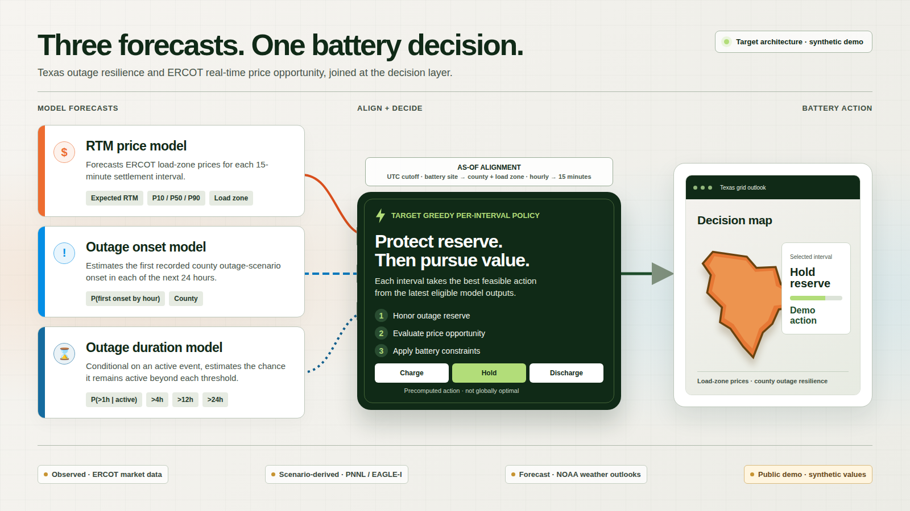

# Texas Outage and Energy Price Predictors

A map-first hackathon demo of a target pipeline that combines an ERCOT price forecast, county outage-onset risk, and active-outage duration estimates into a greedy battery action: **charge**, **hold reserve**, or **discharge**.

## Quick start

```bash
git clone https://github.com/bryannalarcon-hash/texas-outage-and-energy-price-predictors.git
cd texas-outage-and-energy-price-predictors
python3 -m http.server 8099 --bind 127.0.0.1 --directory frontend
```

Open <http://127.0.0.1:8099>. Choose **Dummy data** for the bundled repeatable demo.

## Tech stack & architecture diagram

- **Demo:** native HTML, CSS, JavaScript modules, SVG, and JSON; no runtime packages.
- **Models:** Python, pandas, scikit-learn, LightGBM, and CatBoost in the upstream research pipeline.
- **Decision layer:** the target greedy policy prioritizes outage reserve, then price opportunity and battery constraints.

<picture>
  <source media="(max-width: 600px)" srcset="assets/architecture-mobile.png">
  
</picture>

The public repository contains the runnable demo surface only. An external or future pipeline can write a versioned `frontend/data/model-output.json`; the bundled demo instead uses clearly labeled synthetic data.

## How to reproduce the demo

No API keys are required.

```bash
cp .env.example .env
set -a
. ./.env
set +a
python3 -m http.server "$PORT" --bind "$HOST" --directory frontend
```

The site must be served over HTTP because it loads JavaScript modules and JSON. To test a real export, place a validated `model-output.json` in `frontend/data/` and select **Model output** in the interface.

## Datasets and synthetic data

| Data | Included? | Provenance |
| --- | :---: | --- |
| Demo prices, outage probabilities, and battery actions | Yes | Deterministic synthetic fixture in `frontend/data/dummy-data.json`; not observed conditions or model predictions. |
| ERCOT load-zone shapes | Yes | Schematic trace of the [ERCOT 2023 load-zone map](https://www.ercot.com/news/mediakit/maps); not operational address boundaries. |
| Texas county shapes | Yes | Simplified [Texas Water Development Board county boundaries](https://services.twdb.texas.gov/arcgis/rest/services/PWS/Texas_Counties_FIPS/FeatureServer/0). |
| Terrain relief and city points | Yes | [AWS Terrain Tiles](https://registry.opendata.aws/terrain-tiles/) and the [U.S. Census 2025 Gazetteer](https://www2.census.gov/geo/docs/maps-data/data/gazetteer/2025_Gazetteer/2025_gaz_place_48.txt); display context only. |
| DAM and RTM settlement-point prices | No | [ERCOT market archives](https://www.ercot.com/mktinfo/rtm); raw archives and trained artifacts are excluded. |
| County outage scenarios | No | [PNNL/OEDI merged EAGLE-I scenarios](https://data.openei.org/submissions/6458); these are county scenarios, not household outages. |
| Severe-weather outlooks | No | NOAA/NWS SPC and WPC products processed through the [Iowa Environmental Mesonet archive](https://mesonet.agron.iastate.edu/request/gis/outlooks.phtml). |

## Known limitations & next steps

- The bundled experience is synthetic; it does not issue live forecasts or battery commands.
- The committed frontend consumes precomputed actions; it does not ship the three trained models or a live greedy-policy exporter.
- County outage scenarios cannot establish whether a specific home loses power.
- Load-zone geometry is illustrative, and historical price work lacks complete original publication vintages.
- The bundled precomputed actions omit customer tariffs, battery state, degradation, and device-specific constraints; the target policy must add them.
- Next: publish as-issued model exports, validate home-level outage labels, calibrate uncertainty, and test the policy against real battery economics.
