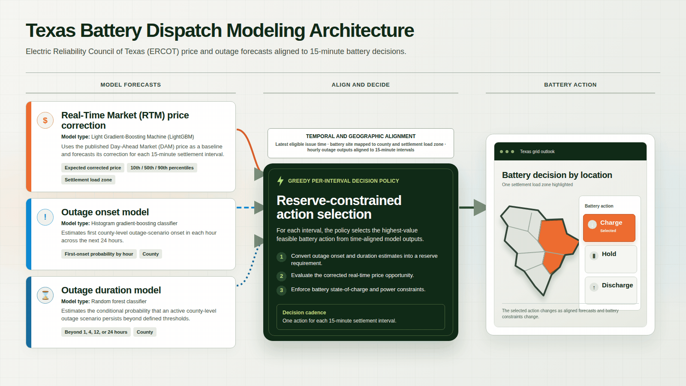

# Texas Outage and Energy Price Predictors

Predicts Electric Reliability Council of Texas (ERCOT) Real-Time Market (RTM) prices from published Day-Ahead Market (DAM) prices and forecasts county outage-scenario onset, then builds a reserve-constrained 15-minute battery schedule. The repository includes the real-data runners, frozen models, scheduled publication service, validation, and browser application.

**Deployed application:** [Texas Outage and Energy Price Predictors](https://bpc.bryannalarcon.com/index.html)

## Quick start

Requires Python 3.12+, Node.js 22+, and the Open Multi-Processing runtime used by Light Gradient-Boosting Machine (LightGBM), such as `libgomp1` on Ubuntu.

```bash
git clone https://github.com/bryannalarcon-hash/texas-outage-and-energy-price-predictors.git
cd texas-outage-and-energy-price-predictors
python3 -m venv .venv
.venv/bin/pip install -r requirements-forecast.txt
.venv/bin/python forecast_server.py --port 8099
```

Open <http://127.0.0.1:8099>, select **Model output**, and use **Pull data & predict** if an automatic run is not already active. The server polls real published ERCOT DAM and National Weather Service outlook data, runs the frozen models, and republishes when eligible inputs change.

## Tech stack & architecture diagram

- **Runtime:** Python Hypertext Transfer Protocol (HTTP) service and scheduler, NumPy, pandas, SciPy, LightGBM, Shapely, and PyShp.
- **Models:** LightGBM Day-Ahead Market (DAM) correction for RTM price; histogram gradient boosting with isotonic calibration for outage onset; random forest with isotonic calibration for conditional outage duration.
- **Schedule:** a reserve-constrained optimizer converts aligned price and outage forecasts into 15-minute charge, hold, and discharge actions.
- **Delivery:** native HyperText Markup Language (HTML), Cascading Style Sheets (CSS), JavaScript modules, Scalable Vector Graphics (SVG), and a validated JavaScript Object Notation (JSON) contract.

<picture>
  <source media="(prefers-reduced-motion: reduce)" srcset="assets/architecture.png">
  
</picture>

The diagram shows the three-model design. All three fitted artifacts are included; the live runner uses price and onset inference, while duration inference remains disabled until a verified active-episode feed is available.

## How to reproduce the deployed pipeline

No Application Programming Interface (API) keys are required. The sample environment only sets the local port; the service always binds to `127.0.0.1`.

```bash
cp .env.example .env
set -a; . ./.env; set +a
.venv/bin/python forecast_server.py --replay
.venv/bin/python forecast_server.py --port "$PORT"
```

Replay is an optional deterministic check using the included 2025 historical input fixture; its timestamps correctly display as stale. Without `--replay`, the service uses real published inputs. `model_assets/` contains the fitted price, outage-onset, and outage-duration artifacts plus checksums. The service polls DAM and weather products every minute, waits ten minutes after first observing a new eligible input set, and atomically writes the validated result to the ignored `frontend/data/model-output.json`.

`forecast_server.py --once` runs one acquisition-and-inference cycle; the normal server command is the continuous runner. Tomorrow's price forecast waits for the actual DAM publication; an available current-day curve can produce a remaining-day forecast, and county forecasts can appear earlier. Frozen inference, dispatch, and historical replay are reproducible from this clone. Training and feature runner source is included, but rebuilding requires the source archives described below. Re-running the exact approved price experiments also requires private preflight approvals and intermediate experiment artifacts. Those records and all raw datasets are intentionally excluded. `frontend/validate-export.mjs` validates model outputs and simulated actions.

Training entry points are `build_price_model_data.py`, `build_price_outage_feature.py`, `train_price_models.py`, `download_eaglei_tx.py`, `build_outlook_features.py`, and `train_outage_models.py`; the experiment runners preserve the selected price-model evaluation workflow.

```bash
.venv/bin/python -m unittest test_forecast_models test_forecast_sources test_forecast_dispatch test_forecast_server
node frontend/check.mjs
npm ci --prefix frontend
npx --prefix frontend playwright install chromium
npm test --prefix frontend
```

## Datasets and synthetic data

Raw training archives are not committed. Sizes below describe the audited local snapshots used to build or verify the shipped pipeline; every source has its own row.

| Source | Model / pipeline destination | Metric pulled | Source link | Dataset size |
| --- | --- | --- | --- | --- |
| ERCOT daily DAM settlement prices | Live RTM price correction input | Hourly Day-Ahead Market Settlement Point Price (DAM SPP), United States dollars per megawatt-hour, for eight settlement load zones | [ERCOT report 12331](https://www.ercot.com/misapp/servlets/IceDocListJsonWS?reportTypeId=12331) | Normal day: 192 retained zone-hours; 177.3 KiB cached sample |
| ERCOT Historical DAM Load Zone and Hub Prices | RTM price correction training baseline | Hourly DAM SPP for eight settlement load zones | [ERCOT NP4-180-ER](https://www.ercot.com/mp/data-products/data-product-details?id=NP4-180-ER) | 2023–2025: 210,432 zone-hours; 5.95 MiB compressed |
| ERCOT Historical RTM Load Zone and Hub Prices | RTM price correction training target | 15-minute Real-Time Market Settlement Point Price (RTM SPP) for eight settlement load zones | [ERCOT NP6-785-ER](https://www.ercot.com/mp/data-products/data-product-details?id=np6-785-er) | 2023–2025: 841,728 matched zone-intervals; 40.30 MiB compressed |
| ERCOT daily RTM settlement prices | Delayed price-model blend calibration | 15-minute RTM SPP labels admitted at least 48 hours after delivery | [ERCOT RTM display](https://www.ercot.com/content/cdr/html/real_time_spp.html) | Normal day: 768 zone-interval values; 75.5 KiB cached sample |
| Pacific Northwest National Laboratory (PNNL) / Open Energy Data Initiative (OEDI) Event-correlated Outage Dataset | Outage onset and duration labels | Derived county event start, end, duration, and peak customers out | [OEDI dataset 6458](https://data.openei.org/submissions/6458) | 2018–2023: 103,068 Texas merged-event rows; 29.81 MiB source ZIP |
| Oak Ridge National Laboratory (ORNL) Environment for Analysis of Geo-Located Energy Information (EAGLE-I) | Outage-duration end-state checks | Recorded customers without power by county at 15-minute cadence | [EAGLE-I Figshare dataset](https://figshare.com/articles/dataset/The_Environment_for_Analysis_of_Geo-Located_Energy_Information_s_Recorded_Electricity_Outages_2014-2022/24237376) | 2018–2023 Texas subset: 14,207,432 rows; 584.77 MiB |
| National Oceanic and Atmospheric Administration (NOAA) / National Weather Service (NWS) Storm Prediction Center (SPC) Day 1 Convective Outlooks | Outage onset and duration weather features | Issued/valid times and maximum categorical convective-risk rank at each county centroid | [Iowa Environmental Mesonet outlook archive](https://mesonet.agron.iastate.edu/request/gis/outlooks.phtml) | 2018–2023: 64,937 polygons; 39.70 MiB compressed |
| NOAA / NWS Weather Prediction Center (WPC) Day 1 Excessive Rainfall Outlooks | Outage onset and duration weather features | Issued/valid times and maximum categorical excessive-rainfall-risk rank at each county centroid | [Iowa Environmental Mesonet outlook archive](https://mesonet.agron.iastate.edu/request/gis/outlooks.phtml) | 2018–2023: 11,823 polygons; 96.81 MiB compressed |
| Texas Water Development Board (TWDB) county boundaries | Outage-model geography and county dashboard | County Federal Information Processing Series (FIPS) code, polygon, and derived centroid | [TWDB FeatureServer](https://services.twdb.texas.gov/arcgis/rest/services/PWS/Texas_Counties_FIPS/FeatureServer/0) | 254 counties; 20.95 MiB raw GeoJSON |
| ERCOT load-zone map | Price dashboard geography | Eight schematic settlement-load-zone regions; not address boundaries | [ERCOT maps](https://www.ercot.com/news/mediakit/maps) | 8 rendered regions; 5.69 KiB JSON |
| Amazon Web Services (AWS) Terrain Tiles | Dashboard context only | Bare-earth elevation converted to shaded relief | [AWS Open Data registry](https://registry.opendata.aws/terrain-tiles/) | 440 fetched tiles; 2 rendered WebP files totaling 2.40 MiB |
| United States Census Bureau 2025 Gazetteer | Dashboard city labels only | Place name and internal-point latitude/longitude | [Texas places file](https://www2.census.gov/geo/docs/maps-data/data/gazetteer/2025_Gazetteer/2025_gaz_place_48.txt) | 1,863 source places / 184.3 KiB; 15 labels used |
| Deterministic synthetic fixture | Frontend tests and explicit fallback | Invented price, outage-risk, and battery-action rows | [`frontend/data/dummy-data.json`](frontend/data/dummy-data.json) | 7,670 rows; 1.67 MiB |

## Known limitations & next steps

- County outage scenarios are not household, feeder, or address-level outage probabilities.
- The live path has no active-episode feed, so the conditional duration artifact and inference path are not yet published.
- Historical ERCOT annual archives do not preserve every original DAM publication vintage; live collection records first observation going forward.
- Battery schedules use four representative county/load-zone pairings and a simulated 25-kilowatt-hour battery; they do not control hardware.
- Next: add verified active-outage state, site mapping, publication-vintage backtests, calibrated uncertainty, and device integration.
